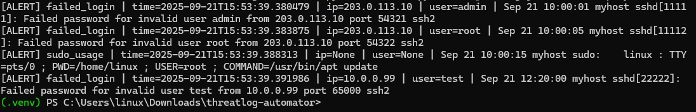
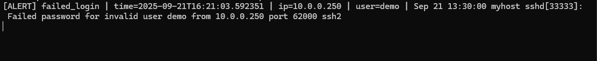
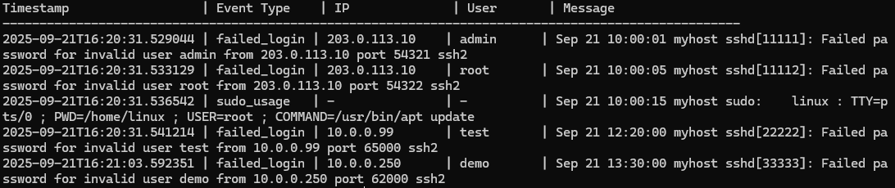

\# ThreatLog Automator


ThreatLog Automator is a Python-based tool I built to explore real-time log monitoring and security automation.  
It detects failed logins and sudo usage from system logs, triggers alerts in real-time or in replay mode,  
and stores everything in a SQLite database for review.  

This project gave me hands-on experience with Python scripting, data parsing, and event-driven automation —  skills I’m continuing to build as I move into larger security automation projects.


---


\## Features

\- \*\*Replay Mode\*\*: Process existing log files for analysis  

\- \*\*Follow Mode\*\*: Real-time monitoring like `tail -f`  

\- \*\*IP + Username Extraction\*\*: Regex-based detection for each event  

\- \*\*SQLite Storage\*\*: All alerts saved for historical review  

\- \*\*Clean Output Viewer\*\*: Easy-to-read table of alerts  

\- \*\*Configurable\*\*: Log path and thresholds via `config.json`  


---


\## Installation

1\. Clone the repository:

&nbsp;  ```bash

&nbsp;  git clone https://github.com/YOUR-USERNAME/threatlog-automator.git

&nbsp;  cd threatlog-automator

&nbsp;  ```


2\. Create a virtual environment:

&nbsp;  ```bash

&nbsp;  python -m venv .venv

&nbsp;  . .venv/Scripts/activate   # Windows

&nbsp;  ```


3\. Install dependencies:

&nbsp;  ```bash

&nbsp;  pip install -r requirements.txt

&nbsp;  ```


---


\## Usage

\### Replay Mode

Process existing log files:

```bash

python src/main.py --config config.json --mode replay

```


\### Follow Mode

Real-time monitoring for new log entries:

```bash

python src/main.py --config config.json --mode follow

```


---


\## View Alerts

Show all alerts stored in the database in a clean table:

```bash

python view\_alerts.py

```


---


\## Configuration

Edit `config.json` to change:

\- Log file path  

\- Detection thresholds  

\- Future email/Slack settings  


---


\## Sample Output

```

\[ALERT] failed\_login | time=2025-09-21T15:30:12 | ip=203.0.113.10 | user=admin | Sep 21 10:00:01 myhost sshd\[11111]: Failed password for invalid user admin

```
**Replay Mode – Historical Log Processing**  
Processes existing logs in bulk and generates alerts for each detection.  


**Follow Mode – Real-Time Detection**  
Monitors logs live and triggers alerts instantly as new events appear.  


**View Alerts – Database Output**  
Displays all stored alerts in a clean table format for easy review.  



---


\## Next Steps

\- Add Slack or email alerts  

\- Build a simple web dashboard  

\- Support more log event types  


---


\## License

MIT License

